# Battery Arbitrage Analysis for Eland Solar & Storage Center

This repository contains scripts for analyzing battery arbitrage opportunities at the Eland Solar & Storage Center using CAISO price data and weather conditions in Kern County, California.

## Project Overview

**Location**: Eland Solar & Storage Center, Phase 2
**Owner**: Avantus
**Capacity**: 200 MW
**Location**: Kern County, CA (35.3733°N, -119.0187°W)
**CAISO Zone**: SP15 (Southern California)
**Trading Hub**: TH_SP15_GEN-APND

## Repository Structure

```
battery_arbitrage/
├── data/                            # Generated data files
├── models/                          # Trained ML models
├── caiso.py                         # Original CAISO analysis (reference)
├── caiso_sp15_data_fetch.py         # CAISO price data fetcher
├── open_metero_weather_data.py      # Weather data fetcher
├── weather_data_interpolator.py     # Weather interpolation tool
├── create_merged_dataset.py         # Data merging script
├── xgboost_price_forecaster.py     # XGBoost forecasting model
├── grid_status_caiso_data_fetch.py  # Alternative CAISO data source
└── data_analysis.ipynb             # Jupyter notebook for analysis
```

## Data Pipeline & Usage Sequence

```mermaid
flowchart TD
    A[📊 CAISO Price Data<br/>caiso_sp15_data_fetch.py] --> A1[Day-Ahead Prices<br/>720 hourly records]
    A --> A2[Real-Time Prices<br/>8,640 5-min records]

    B[🌤️ Weather Data<br/>open_metero_weather_data.py] --> B1[Hourly Weather<br/>720 records, 42 variables]

    B1 --> C[⚡ Interpolation<br/>weather_data_interpolator.py]
    C --> C1[5-min Weather<br/>8,640 records, 42 variables]

    A2 --> D[🔀 Data Merging<br/>create_merged_dataset.py]
    C1 --> D
    D --> D1[Merged Dataset<br/>8,640 records, 53 features]

    D1 --> E[🤖 XGBoost Training<br/>xgboost_price_forecaster.py]
    E --> E1[Train Set<br/>6,884 samples<br/>80%]
    E --> E2[Test Set<br/>1,721 samples<br/>20%]

    E1 --> F[📈 Model Training<br/>111 engineered features]
    F --> F1[Trained Model<br/>RMSE: $2.10/MWh<br/>R²: 0.993]

    F1 --> G[🔮 Forecasting<br/>n-step ahead predictions]
    G --> G1[1-hour forecast<br/>12 steps]
    G --> G2[12-hour forecast<br/>144 steps]

    E2 --> H[📊 Model Evaluation<br/>Performance metrics]
    H --> H1[Visualizations<br/>Feature importance<br/>Prediction plots]

    style A fill:#e1f5fe
    style B fill:#f3e5f5
    style C fill:#fff3e0
    style D fill:#e8f5e8
    style E fill:#fce4ec
    style F fill:#fff8e1
    style G fill:#e0f2f1
    style H fill:#f1f8e9
```



### 1. Fetch CAISO Price Data

**Script**: `caiso_sp15_data_fetch.py`

Fetches Day-Ahead hourly and Real-Time 5-minute LMP prices from CAISO OASIS API for the SP15 zone.

```bash
python caiso_sp15_data_fetch.py
```

**Outputs**:
- `data/eland_sp15_da_prices_2025-08-01_2025-08-31.csv` - Day-ahead hourly prices (720 records)
- `data/eland_sp15_rt_prices_2025-08-01_2025-08-31.csv` - Real-time 5-minute prices (8,640 records)
- `data/eland_sp15_combined_prices_2025-08-01_2025-08-31.csv` - Combined hourly data with spreads

**Sample Results**:
- Price range: $-30.98 to $1,061.20/MWh
- Average price: $19.87/MWh
- Negative price periods: 38.1%
- High price periods (>$100): 0.3%

**Key Features**:
- Uses CAISO OASIS API directly
- Handles rate limiting with exponential backoff
- Respects 31-day API limit
- Provides price statistics and spread analysis

### 2. Fetch Weather Data

**Script**: `open_metero_weather_data.py`

Fetches hourly weather data from Open-Meteo API for the exact Eland Solar location.

```bash
python open_metero_weather_data.py
```

**Outputs**:
- `data/2025-08-01_2025-08-30_open_metero_weather_data.csv` - Hourly weather data

**Weather Variables** (42 total):
- Temperature (multiple altitudes)
- Humidity and atmospheric conditions
- Wind speed/direction (multiple altitudes)
- Precipitation and weather codes
- Soil temperature and moisture
- Atmospheric pressure
- Cloud cover and visibility

### 3. Interpolate Weather Data (Optional)

**Script**: `weather_data_interpolator.py`

Interpolates hourly weather data to match the 5-minute frequency of real-time price data.

```bash
# 5-minute intervals (default - 12 points per hour)
python weather_data_interpolator.py --points-per-hour 12

# Other intervals
python weather_data_interpolator.py --points-per-hour 4   # 15-minute
python weather_data_interpolator.py --points-per-hour 6   # 10-minute
```

**Outputs**:
- `data/2025-08-01_2025-08-30_open_metero_weather_data_5min.csv` - 5-minute interpolated weather data

**Interpolation Methods**:
- **Cubic**: Temperature data (smooth curves)
- **Linear**: Humidity, pressure, cloud cover
- **Circular**: Wind direction (handles 360° boundary correctly)
- **Forward-fill**: Precipitation, weather codes (discrete events)

### 4. Data Merging

**Script**: `create_merged_dataset.py`

Merges CAISO real-time price data with interpolated weather data for analysis.

```bash
python create_merged_dataset.py
```

**Outputs**:
- `data/merged_weather_prices_2025-08-01_2025-08-30.csv` - Combined dataset with 8,640 records

**Features Added**:
- Time-based features (hour, day of week, peak/off-peak)
- Price indicators (negative prices, high prices)
- Temperature conversions (Celsius/Fahrenheit)
- Wind speed conversions (m/s to mph)

### 5. Price Forecasting with XGBoost

**Script**: `xgboost_price_forecaster.py`

Advanced machine learning model for n-step ahead price forecasting using XGBoost.

```bash
# 1-hour forecast (12 x 5-minute intervals)
python xgboost_price_forecaster.py --forecast-steps 12

# 12-hour forecast
python xgboost_price_forecaster.py --forecast-steps 144

# Custom lookback period
python xgboost_price_forecaster.py --lookback-steps 48
```

**Model Performance**:
- **Test RMSE**: $2.10/MWh
- **Test R²**: 0.993 (99.3% variance explained)
- **Test MAE**: $1.24/MWh
- **Training Time**: ~2 minutes on 8,640 samples

**Key Features** (111 total):
- Lagged prices (1-24 steps back = 2 hours)
- Rolling statistics (6, 12, 24 step windows)
- Weather features with temporal lags
- Price change indicators and volatility measures

**Outputs**:
- `models/xgboost_price_model.pkl` - Trained model
- `data/sample_forecast.csv` - Sample predictions
- `data/xgboost_model_results.png` - Performance visualizations

### 6. Analysis and Modeling

**Script**: `data_analysis.ipynb`

Jupyter notebook for correlation analysis and battery arbitrage modeling.

## Data Specifications

### CAISO Price Data
- **Frequency**: Day-Ahead (hourly), Real-Time (5-minute)
- **Unit**: $/MWh (Locational Marginal Price)
- **Market**: DAM (Day-Ahead Market), RTM (Real-Time Market)
- **Node**: TH_SP15_GEN-APND (SP15 Trading Hub)

### Weather Data
- **Frequency**: Hourly (can be interpolated to 5-minute)
- **Coordinates**: 35.3733°N, -119.0187°W (Eland Solar location)
- **Variables**: 42 weather parameters
- **Source**: Open-Meteo Historical Forecast API

### Data Volume Examples
| Dataset | Frequency | Records | Size |
|---------|-----------|---------|------|
| DA Prices | Hourly | 720 | ~24KB |
| RT Prices | 5-minute | 8,640 | ~291KB |
| Weather (Hourly) | Hourly | 720 | ~73KB |
| Weather (5-min) | 5-minute | 8,640 | ~2.1MB |
| Merged Dataset | 5-minute | 8,640 | ~2.3MB |

## Key Analysis Features

### Price Analysis
- Day-Ahead vs Real-Time price spreads
- Price volatility and arbitrage opportunities
- Negative pricing periods (oversupply indicators)
- Peak/off-peak patterns

### Weather Correlations
- Temperature impact on electricity demand
- Wind conditions affecting renewable generation
- Cloud cover correlation with solar output
- Atmospheric pressure and humidity effects

### Battery Arbitrage Metrics
- Optimal charging/discharging schedules
- Revenue potential from price spreads
- Weather-informed predictive modeling
- Risk assessment for different strategies

## Dependencies

```bash
pip install pandas numpy scipy requests openmeteo-requests
pip install requests-cache retry-requests
```

## Configuration

### Date Ranges
- **Current default**: August 1-31, 2025 (modify dates in each script)
- **CAISO limit**: Maximum 31 days per API request
- **Historical data**: Available for past dates only

### Location Settings
All scripts are configured for Eland Solar & Storage Center:
- **Coordinates**: 35.3733°N, -119.0187°W
- **CAISO Zone**: SP15
- **Node**: TH_SP15_GEN-APND

## Alternative Data Sources

### Grid Status API (Alternative)
**Script**: `grid_status_caiso_data_fetch.py`

Alternative CAISO data source using GridStatus.io API (requires API key).

```bash
# Set environment variable
export GRID_STATUS_API_KEY="your_api_key"
python grid_status_caiso_data_fetch.py
```

## Usage Notes

1. **Run scripts in sequence**: Price data → Weather data → Interpolation → Merging → Forecasting → Analysis
2. **Date consistency**: Ensure all scripts use the same date range
3. **API limits**: CAISO OASIS has a 31-day limit per request
4. **Rate limiting**: Scripts include retry logic for API rate limits
5. **Data validation**: Check output files for completeness before analysis
6. **Model dependencies**: Install required packages: `pip install xgboost scikit-learn matplotlib seaborn joblib`

## Output File Naming Convention

```
{start_date}_{end_date}_{source}_{location}_{frequency}_{data_type}.csv

Examples:
- 2025-08-01_2025-08-31_caiso_sp15_combined_prices.csv
- 2025-08-01_2025-08-30_open_metero_weather_data_5min.csv
- eland_sp15_da_prices_2025-08-01_2025-08-31.csv
- merged_weather_prices_2025-08-01_2025-08-30.csv
- sample_forecast.csv
```

## Troubleshooting

### Common Issues

1. **"No price column found"**: Usually indicates future dates or API errors
2. **Rate limiting**: Scripts include automatic retry with exponential backoff
3. **Missing interpolated values**: Fixed in latest version of weather_data_interpolator.py
4. **Date format errors**: Ensure consistent YYYY-MM-DD format

### API Errors

- **CAISO Error 1004**: Date range exceeds 31 days
- **Open-Meteo timeout**: Check internet connection, retry automatically included

## Contributing

When adding new scripts or modifying existing ones:
1. Maintain consistent date range parameters
2. Include proper error handling and rate limiting
3. Follow the naming convention for output files
4. Update this README with new features

## License

This project is for research and analysis purposes related to battery storage arbitrage in California energy markets.